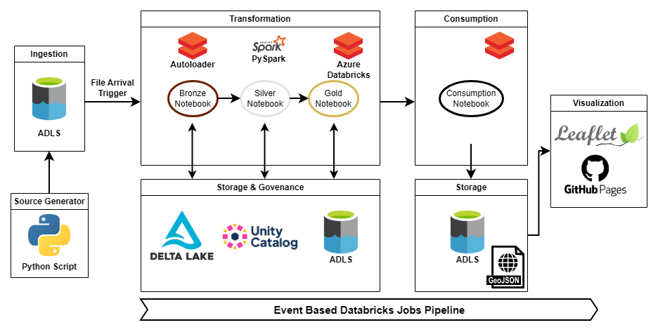
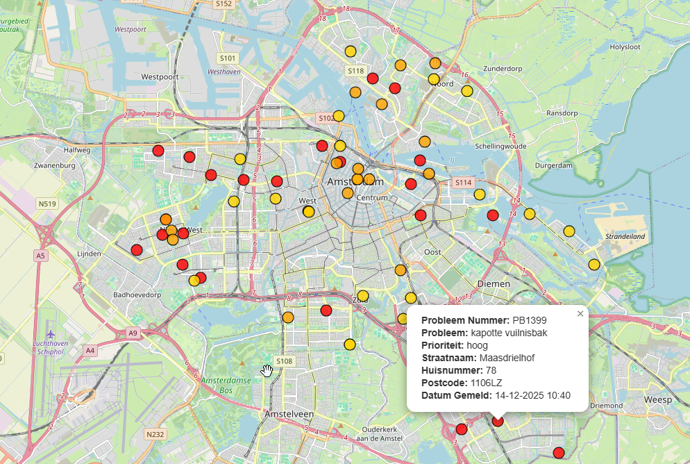

# Amsterdam Incident Report Map

This repository contains an end to end data engineering project that simulates incident reports such as broken garbage collectors and street lights for the city of Amsterdam. The pipeline processes the reports in Azure Databricks using the Medaillon architecture, and publishes a simple interactive Leaflet map from the final consumption layer. The project demonstrates how raw events can be transformed into a small, usable data product with attention to data quality, validation, and reliable processing.

The pipeline is event driven. When a new JSON file arrives in the source container, the Bronze task is triggered automatically. Silver, Gold and Consumption then run as chained tasks within a Databricks Job.

[View the incident reports map](https://italianriver.github.io/city-reports-pipeline/web/)  
This link uses a temporary access token that expires on 19/12.  

## What this project demonstrates

This project demonstrates how an event driven data pipeline can be designed and implemented using the Medaillon layered architecture, with clear separation between ingestion, transformation, governance and consumption to support reliable and maintainable data processing.

## Project Architecture

Source generator script  
→ This script serves for demonstration purposes and generates random fake reports and writes them in JSON format into ADLS in the source layer  

Bronze notebook  
→ Notebook is triggered by file arrival in the ADLS source container
→ Auto Loader ingests JSON incrementally  
→ Adds ingestion metadata  
→ Writes Delta tables to Unity Catalog and the ADLS bronze location  

Silver notebook  
→ Removes duplicates and applies data quality checks  
→ Normalises fields for consistent downstream logic  
→ Enriches records using a static lookup table for location data  
→ Writes Delta tables to Unity Catalog and the ADLS silver location  

Gold notebook  
→ Applies business logic such as priority mapping and status behaviour  
→ Uses SCD Type 1 style upserts via Delta merge  
→ Writes Delta tables to Unity Catalog and the ADLS gold location  
→ Runs a simulation of reports being solved

Consumption notebook  
→ Filters only open cases for visualisation  
→ Builds a GeoJSON file from Spark dataframe
→ Exports the GeoJSON file to the ADLS consumption container  

Leaflet website  
→ Hosted via GitHub Pages  
→ Loads the GeoJSON directly from Azure Storage and refreshes periodically  

### Example of webpage

## Project requirements

→ The system must automatically process new incident reports when they become available. 🗹    
→ Raw incident data must be stored safely before any transformations are applied. 🗹  
→ Data must be cleaned and prepared so it can be used reliably. 🗹  
→ Updates to existing incidents must be handled correctly. 🗹  
→ Updates to the status must be handled correctly and always be accurate. 🗹  
→ Processed data must be easy to use for visualisation and analysis. 🗹  
→ The pipeline must be safe to run multiple times without creating duplicate or incorrect results. 🗹  
→ The overall design must be clear, maintainable and easy to understand. 🗹  
→ The interactive map should allow for manual status change of the report ☐  

## Tech stack

Azure Data Lake Storage Gen2 is used for storage across all layers.  
Azure Databricks is used for data processing and pipeline task orchestration.  
Databricks Auto Loader is used for incremental loading to the Bronze layer.  
PySpark is used for data transformations.  
Delta Lake is used for ACID transactions and reliable upserts.  
Unity Catalog is used for table management and governance.  
Leaflet is used as the map to display the reports, hosted on GitHub Pages.

## Data layers

**Bronze** stores raw ingested events with minimal changes. The purpose of this layer is to function as a source of truth with reliable ingestion and traceability through ingestion metadata.

**Silver** contains cleaned and enriched data. This is where data quality checks, normalisation and enrichment logic are applied.

**Gold** contains consumption oriented data with business rules applied. This layer is designed to be stable and easy to use for reporting and downstream consumers.

**Consumption** produces output in GeoJSON format that is required for the Leaflet map visualisation.

## Data validation, quality and lineage

→ Deduplication is applied in the Silver layer based on the incident identifier to prevent data duplication issues during reruns.  
→ Basic validation checks ensure that essential fields such as incident id, problem description and street name are present before further processing.  
→ Text fields are normalised to support consistent business logic and categorisation.  
→ Timestamps are converted to a consistent format early in the pipeline to ensure reliable ordering and updates.  
→ Location enrichment is performed using a controlled lookup table (heavy filtered national BAG dataset). SQL window function provides best match if no exact match is found.  
→ Clear data lineage is enforced through a strict Bronze Silver Gold structure, with each layer reading only from the previous one.  
→ Delta Lake and Unity Catalog are used to ensure reliable writes, idempotent upserts and transparent table management.  

## SCD Type 1 behaviour

The pipeline applies SCD Type 1 behaviour by overwriting existing records for the same incident identifier using Delta Lake merge operations. A status_updated_at column is maintained to indicate when the current state of a case was last updated.

### Known limitation

In some cases the postcode field may be missing due to incomplete data in the national BAG source. This is a known limitation of the BAG source data rather than the processing logic. The decision to still process and display these reports is intentional, as the geographic location can still be resolved correctly and the incident remains usable for the map.  

